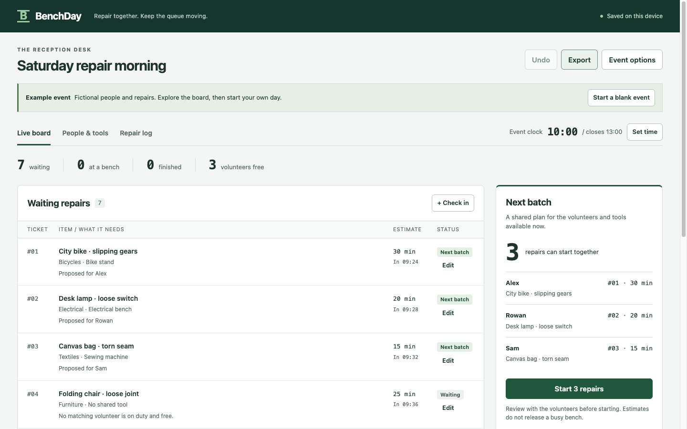

# BenchDay

A reception board for a small community repair event. Match waiting items with available volunteers and shared tools, then record what happened at each bench.

BenchDay runs in the browser without accounts, a database or an external API. The event stays on one device. Its example people and repairs are fictional.

[Watch the 2-minute 41-second walkthrough](https://hyunsikparker.github.io/benchday/demo.html) · [Read the transcript](media/DEMO_TRANSCRIPT.md)



## Run it

Use Node.js 22 or later. There are no packages to install.

```sh
npm start
```

Open **http://127.0.0.1:4177**. To choose another port, run `BENCHDAY_PORT=4180 npm start`.

For static hosting, serve `index.html`, `styles.css`, `manifest.webmanifest`, `sw.js` and the `src` directory together over HTTPS. Relative paths also work in a repository subdirectory. Opening `index.html` directly as a file is not supported.

## Try a repair morning

1. Open the example. Seven items are waiting; three volunteers are available.
2. Review **Next batch**. Alex can take the bicycle, leaving Rowan free for the electrical repair. Sam can work on the bag.
3. Select **Start 3 repairs**, then confirm the assignments. Their tools and volunteers remain reserved.
4. Set the event clock to **10:20**. An elapsed estimate does not free a bench.
5. Record **Repaired** for Sam's bag. The jacket can now be proposed, and the bag appears in **Repair log**.
6. Open **People & tools** to change skills, shifts, duty status and tool capacity. A safety hold keeps an item out of every batch.

Choose **Start a blank event** for your own session. Use nicknames and item descriptions, not visitor contact details. The manual clock must be set before check-in, dispatch and recording outcomes.

## Why batch the assignments?

Assigning the oldest item to the first matching volunteer can leave useful skills idle. In the initial fictional example, that fixed-order baseline starts two repairs. BenchDay starts three by considering the assignments together. This example demonstrates an algorithmic difference; it does not establish shorter waits or better outcomes at real events.

The dispatcher searches for the most simultaneous starts, then prefers the lexicographically oldest set of waiting tickets. It checks:

- the skills and duty status of each volunteer;
- existing assignments and each volunteer's shift;
- the event closing time and the entered duration estimate;
- available units of every required shared tool;
- explicit holds recorded at reception.

Search stops at 150,000 states. If that budget is exhausted, the board shows feasible assignments with a warning that optimality and the oldest-ticket tie-break are unproven. It never releases an active job just because its estimated duration has passed. People remain responsible for safety, estimates and repair decisions.

## Save and recover

Changes are saved in this browser's local storage. Only one tab can edit the event, using the Web Locks API. Other tabs are read-only and receive storage updates. A revision check also rejects stale writes.

**Export** requests a JSON snapshot download. **Event options → Import** validates the schema and its SHA-256 checksum before replacing the event. The checksum detects accidental changes to the event fields; it is not a signature. **Undo** reverses up to 20 changes in the current tab and is cleared on reload.

After a complete first load, a service worker caches the app so the same address can open without a network connection. Browser settings, private browsing or cache eviction may prevent this. Event data and exports are not encrypted. Clearing browser data deletes the saved event, so export regularly and keep backups somewhere appropriate.

The hosted copy uses GitHub Pages. GitHub logs visitor IP addresses for security; BenchDay does not send event contents to the host. See the [GitHub privacy statement](https://docs.github.com/en/site-policy/privacy-policies/github-general-privacy-statement).

## Tests

```sh
npm test
```

Tests cover the greedy-assignment example, holds and shifts, active-resource reservations, stale proposals, invalid transitions, snapshot integrity and storage failures. They also compare the dispatcher with an independent exhaustive oracle on 300 seeded small cases. That comparison does not prove optimality for all inputs or for a search stopped at its budget.

The UI was also exercised in Chrome at desktop and mobile widths. See [VALIDATION.md](VALIDATION.md) for the checks and limits of the evidence.

## Scope

One same-day event, one editing tab, up to 120 repairs, 12 volunteers and 12 tool types. A repair uses one unit of each selected tool. There is no multi-device synchronization, overnight scheduling, automated diagnosis or safety certification. This is a prototype, not a field-tested event-management system.

The implementation uses plain JavaScript modules, semantic HTML, CSS, local storage, Web Locks, Web Crypto and a service worker. The small Node server binds to loopback and serves an explicit file list with a restrictive Content Security Policy. User-entered text is rendered as text, never HTML.

## Context and authorship

Repair Café describes volunteers with different repair skills and hosts who welcome visitors. Existing projects such as Repair Connects already connect people with repairers. BenchDay explores a narrower workflow: allocating the next batch within one event while respecting shared tools.

- [Repair Café: volunteer roles](https://www.repaircafe.org/en/join/become-a-volunteer/)
- [Repair Connects](https://www.repaircafe.org/en/repair-connects-links-repairs-to-repairers/)

This project was created during the Next Byte Hacks V5 build period, starting October 8, 2026. OpenAI Codex generated and iteratively revised the implementation, tests and documentation. Checks described here were run on the resulting code. No earlier completed hackathon application was reused, and no field results or user interviews are claimed.

Released under the [MIT License](LICENSE).
